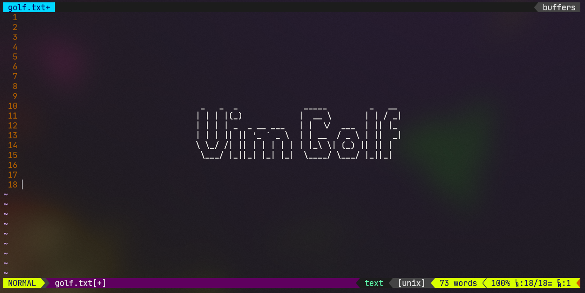
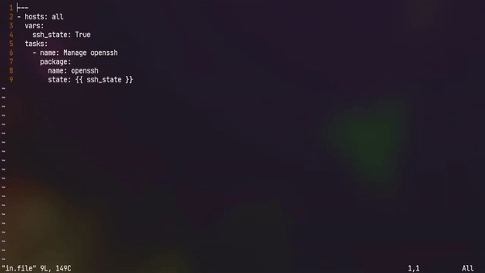
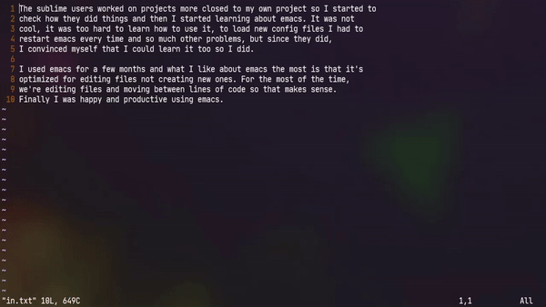
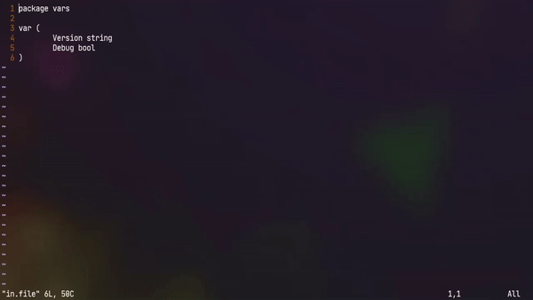
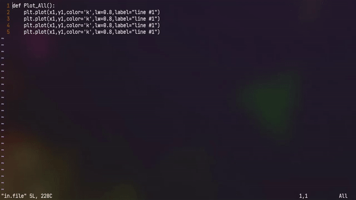
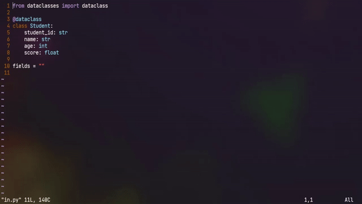

# <div align="center">VimGolf</div>

<p align="center"></p>

<p align="center">


</p>

## # Problem Index
- Add quotes to ansible playbook
- simple replacements
- Satisfy the go linter
- Plotting some variables in python
- Python dataclasses

---

## 1. Add quotes to ansible playbook
<p align="center"></p>

### My Answer
```python
# commands
commands = '}%i"<End><C-@>ZZ'

# Score
score = 8
```

### Description
|Index|Command|Description|Input|
|:-:|:-:|:-:|:-:|
|1|}|현재 문단의 끝|
|2|%|괄호에 매칭되는 곳으로 이동|
|3|i|현재 커서 위치에 삽입|" 입력|
|4|End|해당 라인의 끝으로 이동|
|5|Ctrl+@|이전에 입력된 텍스트를 삽입하고 편집 모드 종료|" 입력|
|6|ZZ|저장 및 종료|

---

## 2. simple replacements
<p align="center"></p>

### My Answer
```python
# commands
commands = 'wcwvim<Esc>6j*qq.nq6@qZZ'

# Score
score = 20
```

### Description
|Index|Command|Description|Input|
|:-:|:-:|:-:|:-:|
|1|w|오른쪽 단어의 처음 부분으로 이동|
|2|cw|단어 변경|vim 입력|
|3|Ctrl+[|입력 모드 종료|
|4|6j|여섯줄 아래로 이동|
|5|*|현재 위치의 단어 찾기|
|6|qq|q라는 이름의 메크로를 생성하고 기록|
|7|.|이전 명령 반복 (커서 이동 명령은 제외)|
|8|n|찾은 문자중에서 다음 문자로 이동|
|9|q|메크로 기록 종료|
|10|6@q|q라는 이름의 매크로를 6번 실행|
|11|ZZ|저장 및 종료|

---

## 3. Satisfy the go linter
<p align="center"></p>

### My Answer
```python
# commands
commands = 'Gqq-O// <C-N> TODO<Esc>q@qZZ'

# Score
score = 20
```

### Description
|Index|Command|Description|Input|
|:-:|:-:|:-:|:-:|
|1|G|파일의 끝으로 이동|
|2|qq|q라는 이름의 메크로를 생성하고 기록|
|3|-|윗 줄로 이동|
|4|O|줄 위에 입력|
|5|Ctrl+N|자동 완성|// Debug TODO 입력|
|6|Ctrl+[|입력 모드 종료|
|7|q|메크로 기록 종료|
|8|@q|q라는 이름의 매크로 실행|
|9|ZZ|저장 및 종료|

---

## 4. Plotting some variables in python
<p align="center"></p>

### My Answer
```python
# commands
commands = '9w<C-V>3jlsabs()<Esc>Pj<C-V>}g<C-A>W.0.fkrbjrrjrgZZ'

# Score
score = 35
```

### Description
|Index|Command|Description|Input|
|:-:|:-:|:-:|:-:|
|1|9w|오른쪽 9번째 단어의 처음 부분으로 이동|
|2|Ctrl+V|다중 선택 모드|
|3|3j|세줄 아래로 이동|
|4|ㅣ|오른쪽으로 한 칸 이동|
|5|s|단어 삭제 후 입력|abs() 입력|
|6|Ctrl+[|입력 모드 종료|
|7|P|복사, 삭제된 내용을 커서 다음 칸에 붙혀넣기 명령|
|8|j|한 줄 아래로 이동|
|9|Ctrl+V|다중 선택 모드|
|10|}|현재 문단의 끝|
|11|g<C-A>|숫자 증가 명령어, g 확장 명령과 같이 사용시 선택 영역의 숫자를 순차적으로 증가|
|12|W|공백 기준으로 다음 단어의 처음으로 이동|
|13|.|이전 명령 반복 (커서 이동 명령은 제외)|
|14|0|줄의 처음으로 이동|
|15|.|이전 명령 반복 (커서 이동 명령은 제외)|
|16|fk|한 문자 검색, k 문자 검색|
|17|rb|한 문자 교체, b로 교체|
|18|j|한 줄 아래로 이동|
|19|rr|한 문자 교체, r로 교체|
|20|j|한 줄 아래로 이동|
|21|rg|한 문자 교체, g로 교체|
|22|ZZ|저장 및 종료|

---

## 5. Python dataclasses
<p align="center"></p>

### My Answer
```python
# commands
commands = '/"<CR>as<C-N><C-N>,n<C-N>,a<C-N>,sc<C-N><Esc>ZZ'

# Score
score = 20
```

### Description
|Index|Command|Description|Input|
|:-:|:-:|:-:|:-:|
|1|/"|아래줄 순서로 검색, " 검색 및 이동|
|2|Ctrl+m|Enter 키|
|3|a|커서 다음에 입력|s 입력|
|4|Ctrl+N Ctrl+N|자동 완성란의 두번째 자동 완성 단어 선택|,n 입력|
|5|Ctrl+N|자동 완성|,sc 입력|
|6|Ctrl+N|자동 완성|
|7|Esc|입력 모드 종료|
|8|ZZ|저장 및 종료|
